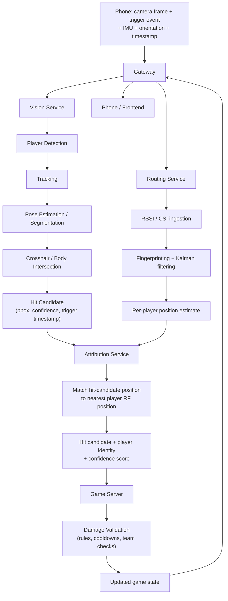

# Hit Detection Pipeline

Hit detection is the core real-time loop of the game. The phone never
determines whether it hit someone — it reports what it saw and when the
trigger was pulled, and the server pipeline reconstructs whether that trigger
pull actually corresponds to a hit, and on whom.

## Concept

The phone is mounted on the player's gun, camera facing down the barrel.
Instead of simulating a bullet, the server asks: *did the crosshair intersect
another player's body at the precise trigger timestamp?* Answering that
requires two independent signals that get fused together:

1. **Where is a body in the frame, and does the crosshair intersect it?**
   (Vision)
2. **Which player does that body belong to?** (Routing + Attribution)

## Pipeline

## Why two independent signals

Vision alone can tell you a crosshair is on *a* body — in a crowded arena it
cannot reliably tell you *whose* body, especially under occlusion, similar
clothing, or fast motion. RF localization alone can tell you roughly where
each player's phone is, but says nothing about aim or line of sight.
Attribution exists specifically to fuse the two: it takes Vision's
spatial hit candidate and Routing's per-player position estimates and
resolves identity, with a confidence score, before the Game Server ever sees
the event. If confidence is too low, the Game Server can reject the hit
candidate rather than guess.

## Key concepts

- **Trigger timestamp** — the authoritative moment of intent. All matching
  (crosshair intersection, RF position lookup) is done relative to this
  timestamp, not to when packets happen to arrive.
- **Confidence scoring** — every stage (detection, pose, RF match) attaches a
  confidence value. The Game Server can apply a minimum-confidence threshold
  rather than trusting a single binary signal.
- **Server authority** — nothing in this pipeline runs on the phone. The
  phone's only job is to capture and timestamp accurately.

## Planned improvements

- **Temporal interpolation** — smoothing pose/position across frames near the
  trigger timestamp, rather than relying on a single frame.
- **IMU-assisted aiming** — using gyroscope/accelerometer data to refine
  crosshair direction between frames.
- **Multi-frame analysis** — evaluating a short window around the trigger
  event instead of a single frame, to reduce false negatives from motion
  blur or momentary occlusion.
