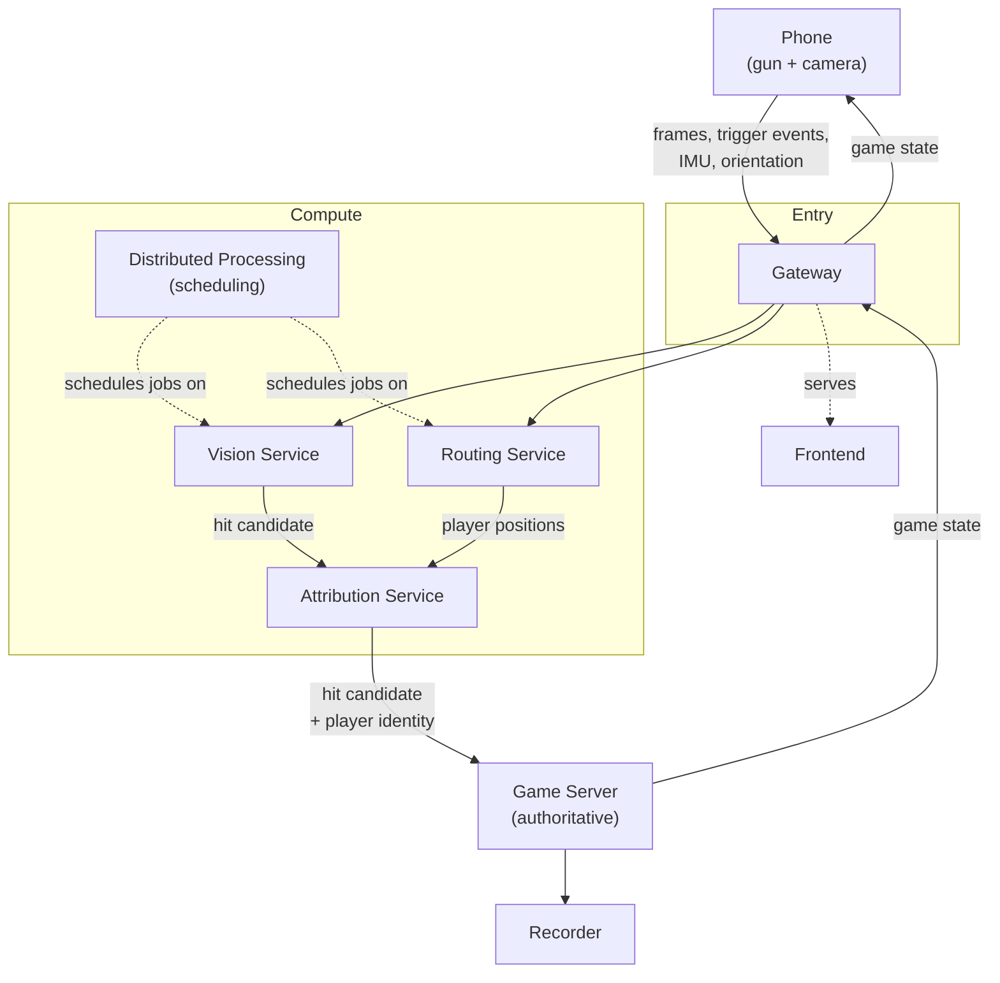

# Architecture Overview

RLPUBG is split into independently deployable services that communicate over
well-defined protocols. No service trusts client-reported outcomes — the
phone reports raw sensor data and intent (trigger pulled, frame captured),
and servers reconstruct what actually happened.

## Status of each service

| Service | Status | Role |
|---|---|---|
| [Vision](../services/vision.md) | In progress | CV inference: detection, tracking, pose, hit candidates |
| [Routing](../services/routing.md) | In progress | RF-based indoor player localization |
| [Distributed Processing](../services/distributed-processing.md) | In progress | Worker/GPU scheduling, job dispatch |
| [Frontend](../services/frontend.md) | In progress | React player UI |
| [Gateway](../services/gateway.md) | Proposed | Single entry point for phones |
| [Game Server](../services/game-server.md) | Proposed | Authoritative game logic |
| [Attribution](../services/attribution.md) | Proposed | Resolves a hit candidate to a player identity via RF | 
| [Recorder](../services/recorder.md) | Proposed | Gameplay recording for replay/analytics/ML |

See [ADR 0003](../adr/0003-attribution-service.md) for why Attribution is a
separate service rather than folded into Routing.

## System diagram

## Design principles

1. **Server authoritative gameplay.** Clients render; servers decide.
2. **Independent deployable services.** Each service in `apps/` ships and
   scales on its own.
3. **Shared protocol definitions.** Message schemas live in `libs/protocol`,
   not duplicated per service.
4. **Thin mobile clients.** Phones capture and stream; they don't infer.
5. **GPU-centric inference.** CV and any heavy ML run on centralized GPU
   servers, not on-device.
6. **Modular architecture.** Services own one responsibility each.
7. **Testability.** Unit tests per service, integration/e2e/perf/stress tests
   at the repo level.
8. **Scalability.** Designed for many concurrent players in an indoor arena.
9. **Clear separation of concerns.** Vision detects *possible* hits; only the
   Game Server decides if damage applies.
10. **Research-driven development.** Localization and CV model choices are
    tracked as documented experiments, not assumed.

See [Architecture Decision Records](../adr/index.md) for the reasoning behind
specific structural choices.
